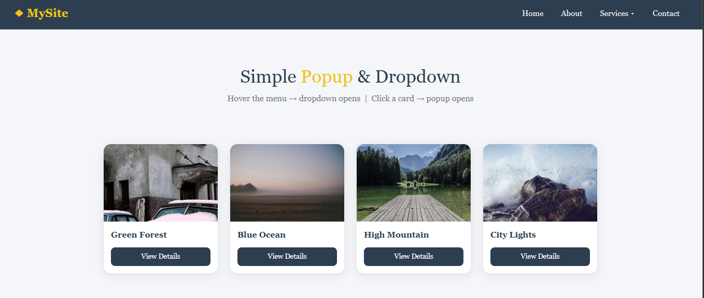

# 05Htmlshopapplication
opup & Dropdown UI Design – HTML, CSS & JavaScript Project
📘 About This Project

This project is a modern interactive webpage that demonstrates:

Navigation bar with dropdown menu

Responsive card layout

Popup modal using JavaScript

Clean UI design

It is created using:

HTML5

CSS3

JavaScript

Bootstrap 5 (CDN)

There is no backend.
There is no database.

This project helps students understand how interactive UI elements work using JavaScript.

🎯 What Students Will Learn

After completing this project, students will understand:

How to create a navigation bar

How to create dropdown menu using CSS

How to create card layouts

How to use Flexbox

How to open and close popup using JavaScript

How to manipulate DOM using JavaScript

How to use Bootstrap CDN

How to link external CSS file

How to structure a frontend project

🖥 Design Features

This design includes:

Custom styled navigation bar

Hover-based dropdown menu

Hero section

Responsive card layout

Image cards with hover effect

Popup modal with overlay

Smooth zoom animation

Close button functionality

Clean and modern UI

🔷 Project Folder Structure

Since you added CSS and image folders, your project structure should look like this:

06HtmlCssWithJavaScript/
│
├── index.html
├── README.md
│
├── css/
│   └── style.css
│
└── images/
    ├── forest.jpg
    ├── ocean.jpg
    ├── mountain.jpg
    └── city.jpg

Make sure:

CSS file is inside css folder

Images are inside images folder

Paths are correctly linked

Example CSS linking:

<link rel="stylesheet" href="css/style.css">

Example image path:

🔷 How Bootstrap Is Added

Bootstrap is added using CDN inside <head>.

<link href="https://cdn.jsdelivr.net/npm/bootstrap@5.3.2/dist/css/bootstrap.min.css" rel="stylesheet">

Bootstrap JS is added before closing </body>:

This allows usage of Bootstrap classes like:

container

card

shadow

mt-4

etc.

🔷 How Dropdown Menu Works

Dropdown is created using:

position: relative

position: absolute

:hover selector

Hidden menu:

.dropdown-menu {
  display: none;
}

Show on hover:

.dropdown:hover .dropdown-menu {
  display: block;
}

This creates hover-based dropdown without JavaScript.

🔷 How Popup Works (JavaScript Logic)

When user clicks "View Details" button:

function openPopup(img, title, text)

JavaScript:

Changes image source

Updates title text

Updates description text

Adds active class to overlay

To close popup:

function closePopup()

Removes active class from overlay.

This is called DOM manipulation.

🔷 JavaScript Concepts Used

Functions

Parameters

getElementById()

innerText

classList.add()

classList.remove()

Event handling

onclick event

🔷 CSS Concepts Used

Flexbox

Hover effects

Position absolute & relative

Box shadow

Border radius

Animation using @keyframes

Overlay background

Responsive layout
🔷 HTML Tags Used

| Tag        | Purpose            |
| ---------- | ------------------ |
| `<html>`   | Root element       |
| `<head>`   | Metadata and links |
| `<title>`  | Page title         |
| `<link>`   | Connect CSS        |
| `<script>` | JavaScript         |
| `<body>`   | Visible content    |
| `<nav>`    | Navigation bar     |
| `<ul>`     | List container     |
| `<li>`     | List item          |
| `
`    | Layout section     |
| ``    | Display image      |
| `<button>` | Click button       |
| `<h1>`     | Main heading       |
| `
`      | Paragraph          |
| ``   | Inline styling     |

📱 Responsive Behavior

Desktop → Cards display in row

Tablet → Adjusted layout

Mobile → Cards stack vertically

Flexbox and Bootstrap handle responsiveness.

📸 Output

💡 Purpose of This Project

This project is created for learning frontend development.

Will understand how interactive UI components work using:

HTML structure

CSS styling

DOM manipulation

This is a beginner to intermediate level frontend project.
